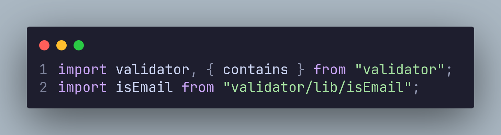

# Newsletter Signup Page with Email Validation

This is a solution to the **Newsletter sign-up form with success message** from [Frontend Mentor](https://frontendmentor.io).

- [Newsletter Signup Page with Email Validation](#newsletter-signup-page-with-email-validation)
  - [Preview](#preview)
    - [Desktop](#desktop)
    - [Mobile](#mobile)
  - [Tools and Language](#tools-and-language)
    - [Tools](#tools)
    - [Language](#language)
  - [Process](#process)
  - [What I learned](#what-i-learned)
    - [Adding the JS file to HTML](#adding-the-js-file-to-html)
    - [Using the Validator Library](#using-the-validator-library)
    - [Implementing the validation](#implementing-the-validation)
  - [Links](#links)

## Preview

### Desktop


### Mobile


## Tools and Language

### Tools

- [Visual Studio Code](https://code.visualstudio.com)
- [Firefox](https://mozilla.org/firefox)
- [Brave](https://brave.com)
- [Vite](https://vitejs.dev)
- [Validator](https://npmjs.com/packages/validator)

### Language

- HTML
- CSS
- JS

## Process

Creating the application using the command line.

```
npm create vite@latest -- --template vanilla app

cd app

npm install

npm install validator

npm run dev
```

## What I learned

I learned to use the library. It is the first time ever that I have used an npm library to implement a function to my website. It was very useful and was easy to implement.

### Adding the JS file to HTML

Add the `app.js` file to the HTML using the `script` tag.


### Using the Validator Library

Import the library.



### Implementing the validation

Add the `submit` event to the form and use Validator to check whether the value of the `input` is correctly formatted as an email.


## Links

- [Live Site](https://newsletter-signup-code-beaker.vercel.app/)
- [Repository](https://github.com/Code-Beaker/newsletter-signup-code-beaker)
